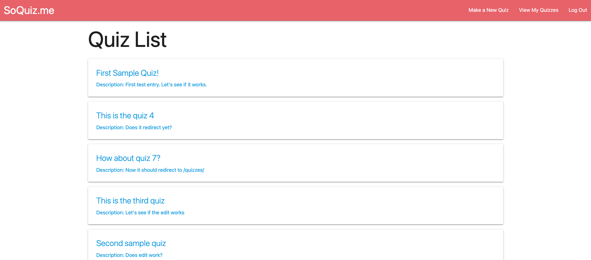
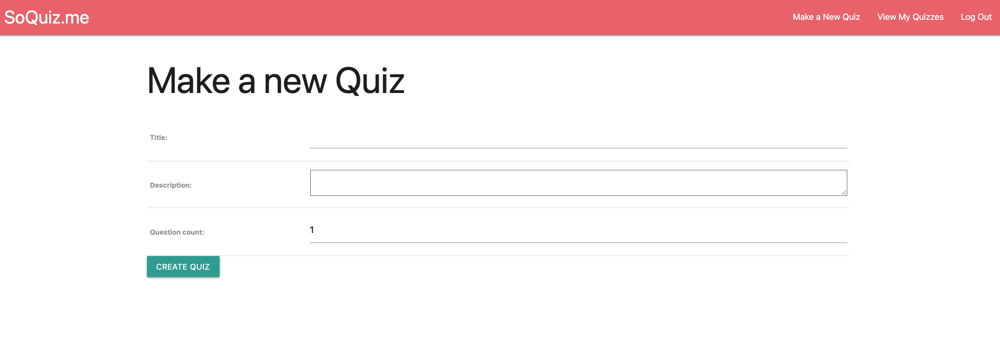
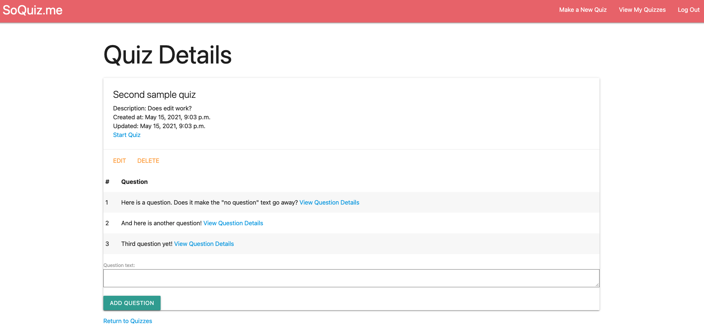
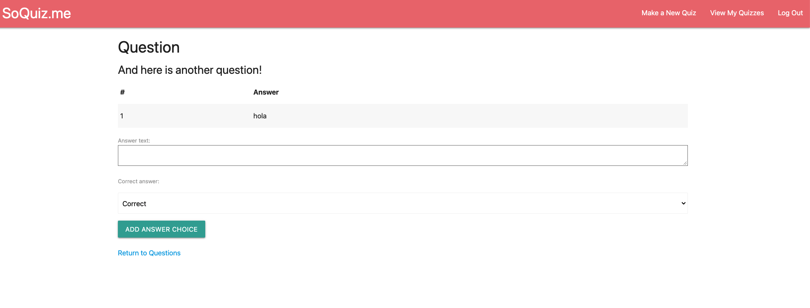

# SoQuiz.me

This app was created as a technology demonstrator and captone project for General Assembly's Software Engineering Immersive program.  The goal of this project was to create an app entirely in the Django framework for Python.  As of now this project remains a work in progress as Django does not have built-in DOM manipulation abilities.

# Getting Started

Deployed App on Heroku (in progress)

[Trello Board](https://trello.com/b/HG4idi9N/unit-4-project)

# Screenshots

**Quizzes Index Page**

**New Quiz Creation Page**

**Quiz Details Page**

**Question Details Page**

# Technologies Used

* Python3/Django
* Microsoft VS Code
* HTML5/CSS
* Materialize UI
* Google Chrome (Display and DevTools)

# Icebox Features
* Rebuild with MongoDB and React.  Get rid of Materialize and use Bootstrap.  This will likely be a total gut job.
* Add the ability for users to make quizzes or private.
* Add the ability for users to view all public quizzes or only their own quizzes.
* Add the ability to TAKE quizzes (this 100% requires DOM manipulation).
* Add enterprise reporting so users can view summary statistics on quiz performance.
* Create permission levels so an instructor can make a quiz for students and evaluate performance.
* Use Google OAuth.
* Repurpse the current splash page on `/about` and remake the splash page into a user hub.